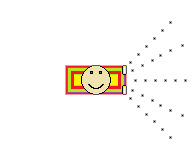
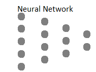
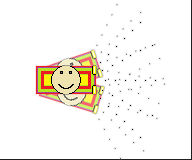

# AI car
This project is to apply AI to make autonomous car. The job of car is to finish the track without hitting the walls. Car is trained with the help of feedfordward Neural Network and Genetic Algorithm(with some modification).

## Libraries, Tools and Algorithms used
* Python3 
* Keras
* Pygame
* Spyder
* Paint
* PhotoShop
* Neural Network
* Genitic Algorithm

## Approach
   
 
 We have designed a car which detect THE WALL with the help of sensors which can be seen in the above image. These sensor's data act as a input to the neural netuork and output of neural network provide direction to car.
 
 
